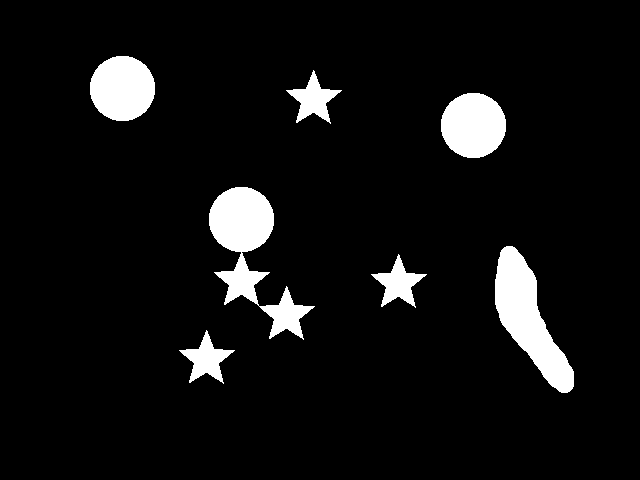
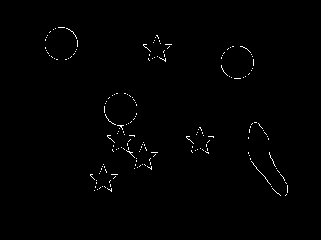
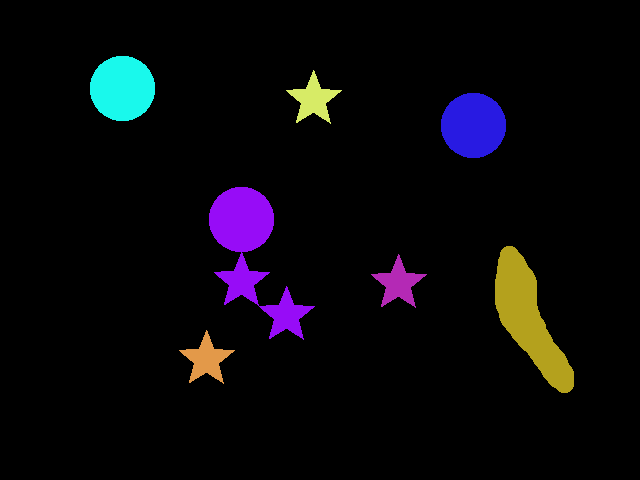

# Binary region analysis

- input image


- output contours


- output labels


```d
import dcv.core;
import dcv.io.image;
import dcv.plot;
import dcv.imgproc;
import dcv.measure;

import mir.ndslice;
import mir.math.stat: mean;

int main(string[] args)
{
    Image img = imread("../data/test_labels.png"); // read an input image

    Slice!(ubyte*, 2) gray = img.sliced.rgb2gray; // convert it to gray level
    auto hist = calcHistogram(gray.flattened); // compute histogram
    
    auto thr = getOtsuThresholdValue(hist); // determine a threshold
    
    auto imbin = threshold!ubyte(gray, cast(ubyte)thr); // threshold the image
    
    auto labels = bwlabel(imbin); // create label matrix

    auto cntrs = findContours(imbin); // find contours (binary boundaries)
    
    foreach(contour; cntrs) // iterate over the regions
    { 
        auto moments = calculateMoments(contour, imbin);
        auto ellipse = ellipseFit(moments);
        writeln("Orientation: ", ellipse.angle);
        writeln("Minor axis length: ", ellipse.minor);
        writeln("Major axis length: ", ellipse.major);
        writefln("Centroid x: %f Centroid y; %f", contour[0..$, 0].mean, contour[0..$, 1].mean);
        writeln("Bounding box: ", boundingBox(contour));
        writeln("convexHull indices: ", convexHull(contour)[]);
        writeln("Area: ", moments.m00); // or contour.contourArea
        writeln("Perimeter: ", contour.arcLength);
    }
    
    auto labelimg = label2rgb(labels); // visualize the label matrix
    auto cimg = contours2image(cntrs, imbin.shape[0], imbin.shape[1]); // visualize the contours

    imshow(cimg, "cimg");
    imshow(labelimg, "labelimg");
    
    waitKey();
    
    return 0;
}
```